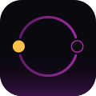

# Saros

**See the pattern. Catch the drift.**

You run several AI coding agents at once, each in its own terminal and worktree.
Saros lives in your Mac's notch and watches them for you: it surfaces the one waiting
on a human decision, lets you answer from the notch, and warns you when two agents
start editing the same files.

### Live agent status
Every running Claude Code and Codex session gets a row: working, waiting on you,
done or error, with its worktree and elapsed time.

### Decisions from the notch
A permission request or an agent's question opens a card right under the notch.
Allow, Deny or answer without hunting for the terminal.

### Collision warnings
When two agents touch overlapping files from parallel worktrees, Saros flags it
before either branch merges.

### Terminal jump
Click a row to bring that agent's terminal, VS Code window or Claude desktop to the front.

---

Native macOS app (Swift + SwiftUI). macOS 14 or newer. Displays without a notch get a
floating glass pill instead.
Buy once: no subscription, no account, no telemetry. Everything stays on your Mac.

**This repository hosts the public changelog, release notes and issue tracker. The
application source is closed.**

- [Download Saros 1.0.1](https://github.com/by-astrohub/saros-changelog/releases/download/v1.0.1/Saros-1.0.1-arm64.dmg) (Apple Silicon, macOS 14+)
- [Changelog](CHANGELOG.md)
- [Releases](../../releases)
- [Report an issue](../../issues)

An AstroHub app, after <a href="https://github.com/by-astrohub/astrolabe-changelog">Astrolabe</a>.
